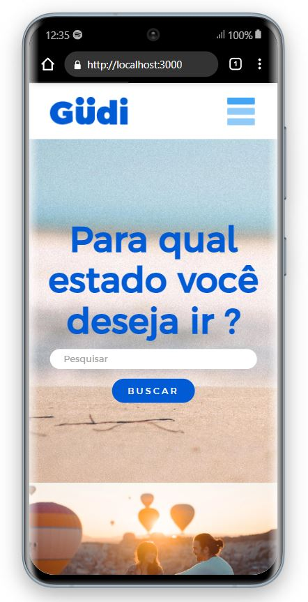
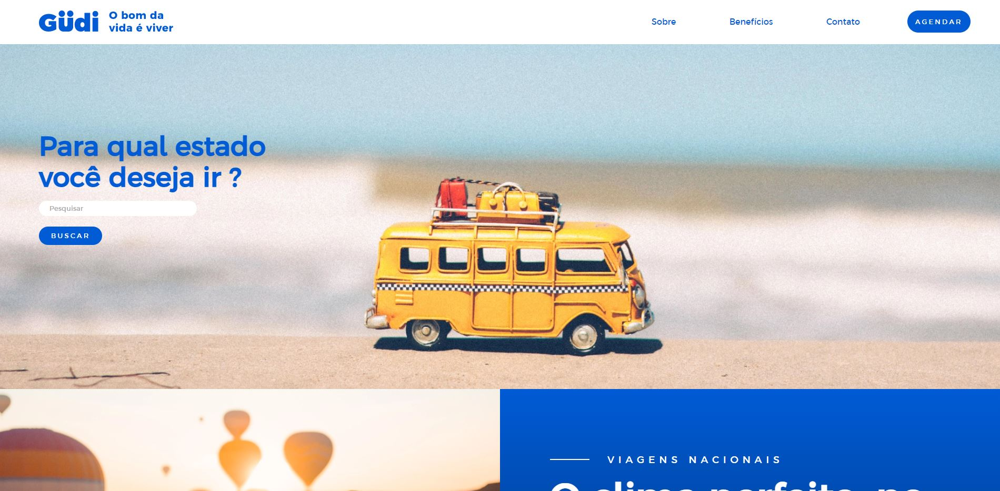

## 💻 About the project

Project developed for the purposes of good practices and learning and applying for a job as a Developer.

---


### Mobile Layout ###

<p align="center">
  
</p>

### Web Layout ###

<p align="center" style="display: flex; align-items: flex-start; justify-content: center;">
  
</p>

---

### Pre requisites ###

Before starting, you will need to have the following tools installed on your machine:
[Git](https://git-scm.com), [Node.js](https://nodejs.org/en/). 
Also it's nice to have an editor to work with the code like [VSCode](https://code.visualstudio.com/)


#### 🧭 Running the web application ####

```bash

# Clone this repository
$ git clone https://github.com/dwmedeirosDev/Gudi-Project.git

# Access the project folder in your terminal
$ cd Gudi-Project

# Install the dependencies
$ npm install

# Run the application in development mode
$ npm run start

# The application will open in port:3000 - Login http://localhost:3000

```

---

###c 🛠 Technology 🛠 ###

 

* Styled-Components

---

 <div align="center">
 
 <br />
 <b>David Medeiros - Front End Developer</b>
 <br />
 <br />
  <pre><i>My contacts 📱</i></pre>
  
  [](https://www.linkedin.com/in/dwmedeiros/)
  [](mailto:dwmedeiros94@hotmail.com)
  [](https://wa.me/5521982916500)
</div>

